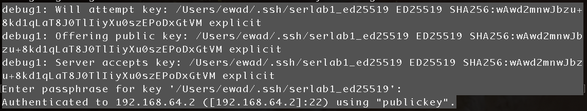
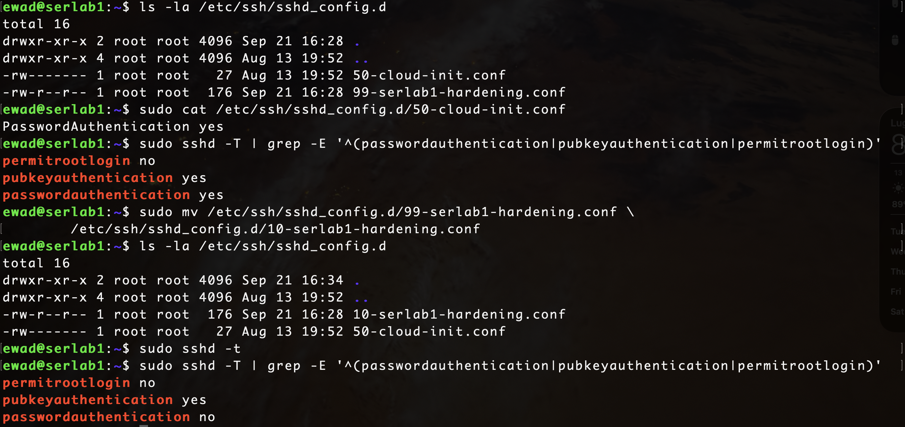
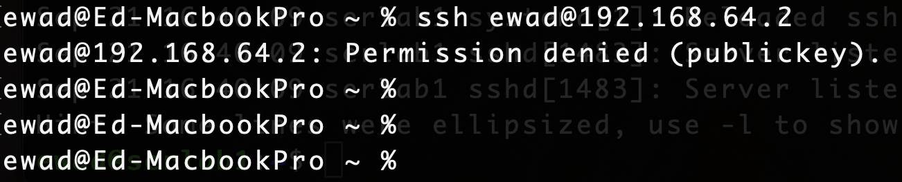

# SSH Hardening

## Objective

Secure remote administrative access to the serlab1 Ubuntu Server by implementing public-key authentication.

## Lab Environment

- **Server:** serlab1
- **Operating System:** Ubuntu Server (ARM64)
- **Hypervisor:** UTM
- **Client:** macOS
- **Remote Administration:** OpenSSH

## Implementation

### SSH Key Generation

An Ed25519 SSH key pair was generated on the macOS client specifically for remote administration of serlab1. A passphrase was configured to protect the private key.

The public key was copied to the `authorized_keys` file for the administrative user on serlab1. The private key remains on the client system. 

### Public-Key Authentication Validation

SSH verbose output was used to verify that the server accepted the configured key and authenticated the client using public-key authentication. 



### SSH Server Hardening

A custom OpenSSH configuration was created to enforce the following settings: 

```text
PubkeyAuthentication yes
PasswordAuthentication no
PermitRootLogin no
```

The configuration was first checked for syntax errors using: 

```bash
sudo sshd -t
```

The effective OpenSSH configuration was then inspected using: 

```bash
sudo sshd -T | grep -E '^(passwordauthentication|pubkeyauthentication|permitrootlogin)'
```

## Troubleshooting Configuration Precedence

Initial validation showed that password authentication remained enabled despite the custom hardening configuration specifying `PasswordAuthentication no`.

The effective configuration returned:

```text
permitrootlogin no
pubkeyauthentication yes
passwordauthentication yes
```

Investigation of the `/etc/ssh/sshd_config.d/` directory identified an existing `50-cloud-init.conf` configuration file. Its contents included:

```text
PasswordAuthentication yes
```

Because OpenSSH uses the first value obtained for these global configuration directives, `50-cloud-init.conf` was being processed before the original `99-serlab1-hardening.conf` file. As a result, the cloud-init setting for `PasswordAuthentication` took precedence.

The custom configuration file was renamed to `10-serlab1-hardening.conf` so that it would be processed before `50-cloud-init.conf`.

The configuration was then revalidated with `sshd -t` and the effective settings were checked again with `sshd -T`.

The effective configuration now confirmed the intended SSH security controls:



## Validation

After reloading the SSH service, a new SSH session was successfully established using the Ed25519 key, confirming that public-key authentication remained functional.

A connection attempt without specifying the authorized private key was then performed to verify that password authentication was no longer available:

```bash
ssh ewad@192.168.64.2
```

The server rejected the connection with `Permission denied (publickey)` rather than prompting for the user's account password.



## Security Outcome

The completed configuration requires SSH public-key authentication for remote access to serlab1. Password-based SSH authentication and direct root login are disabled.

The implementation was validated through both positive and negative testing: authentication with the authorized Ed25519 key succeeded, while a connection without the authorized key was rejected without offering password authentication.

## Lessons Learned

This exercise demonstrated the importance of validating the effective state of a service rather than assuming that a configuration change has been applied. Although the custom SSH configuration was syntactically valid, an existing cloud-init configuration initially took precedence and kept password authentication enabled.

Using `sshd -t` to validate syntax and `sshd -T` to inspect the effective configuration helped identify and resolve the issue before the SSH service was reloaded. Maintaining existing SSH sessions during configuration changes also provided a recovery path in case the new authentication settings prevented new connections.
