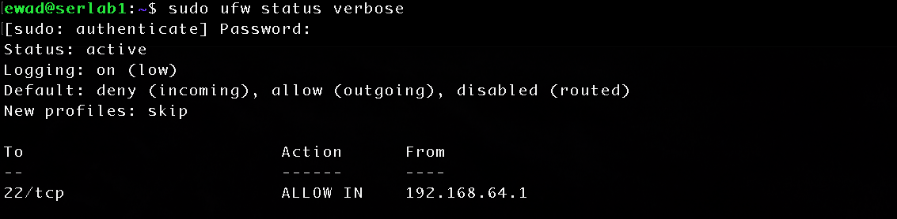

# Host Firewall Hardening with UFW

## Objective

Secure inbound network traffic using a least-privilege firewall policy by configuring and enabling UFW. 

## Lab Environment

- **Server:** serlab1
- **Operating System:** Ubuntu Server (ARM64)
- **Hypervisor:** UTM
- **Client:** macOS
- **Remote Administration:** OpenSSH

## Implementation

### Baseline Assessment

Checked Uncomplicated Firewall (UFW) status and determined it was installed but inactive.

```bash
sudo ufw status verbose
```

Inspected listening TCP/UDP sockets prior to configuring the firewall. 

```bash
sudo ss -tulpn
```

Observed expected Chrony and local DNS resolver services bound to local interfaces.  

SSH on TCP/22 was identified as the intentional network-facing administrative service, providing a basis for permitting SSH while maintaining a default-deny policy for other inbound traffic.

### Firewall Policy Configuration

A default-deny policy was configured for inbound traffic while outbound traffic was allowed by default.

```bash
sudo ufw default deny incoming
sudo ufw default allow outgoing
```

Because SSH is required for remote administration, an inbound exception was created for TCP/22. Access was restricted to the macOS host at `192.168.64.1` rather than allowing SSH connections from any source.

```bash
sudo ufw allow from 192.168.64.1 to any port 22 proto tcp
```

The configured rules were reviewed prior to activating the firewall:

```bash
sudo ufw show added
```

After verifying the SSH exception, UFW was enabled:

```bash
sudo ufw enable
```

## Validation

Confirmed UFW was active with inbound traffic set to default-deny, and outbound traffic set to default-allow. SSH using TCP/22 was permitted only from `192.168.64.1`.

```bash
sudo ufw status verbose
```

Successfully established a new SSH session after enabling UFW, confirming that the permitted administrative path remained accessible. 

Rebooted serlab1, authenticated with new SSH session, and checked UFW status again to verify that the firewall policy persisted after reboot. 

```bash
sudo ufw status verbose
```



### Underlying Firewall Inspection

Inspected the underlying firewall rules configured through UFW and confirmed that they reflected the intended policy, including restricting TCP/22 access to source address `192.168.64.1`. Observed connection tracking rules permitting established and related traffic, demonstrating stateful packet filtering. 

```bash
sudo nft list ruleset
```

Noted when checking UFW status that it reported `active (exited)` because UFW does not need a continuously running service. Rather it loads and configures the firewall rules and then exits while the Linux kernel enforces packet filtering. 

```bash
sudo systemctl status ufw
```

## Security Outcome

Successfully configured a least-privilege firewall policy using UFW. Inbound traffic is denied by default, outbound traffic is allowed by default. SSH administrative access with TCP/22 is restricted to source address `192.168.64.1`. Validation testing confirmed UFW is enabled and policy intact following server reboot. SSH remained functional from explicitly allowed source address. 

## Lessons Learned

Assessing the current socket statistics is vital to determine the current state and exposure of the system. Once that is understood, firewall configuration can be created to harden the system. Noted that local and peer addresses describe the endpoints of a connection during this process and the loopback addresses, `0.0.0.0`, and interface-specific addresses provide additional information about the exposure of a service and socket. 

UFW is a management interface over lower-level Linux packet filtering and does not require an active service or daemon to function. Instead it loads and configures the policy rules at startup and the kernel is responsible for packet filtering. Reviewing the changes to the underlying firewall rules also revealed stateful filtering that makes decisions based on connection state. 

Finally, multiple SSH sessions were used during firewall configuration to reduce the risk of accidental lockout, reinforcing the practice of validating changes both after implementation and system reboot. 

