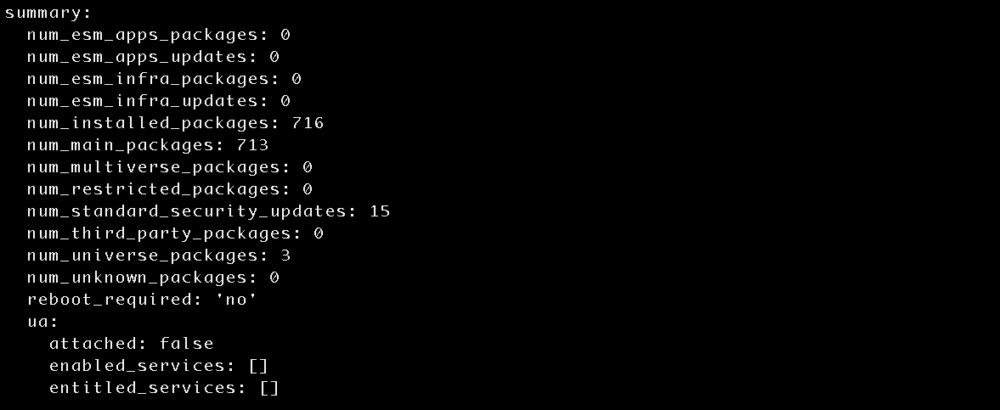
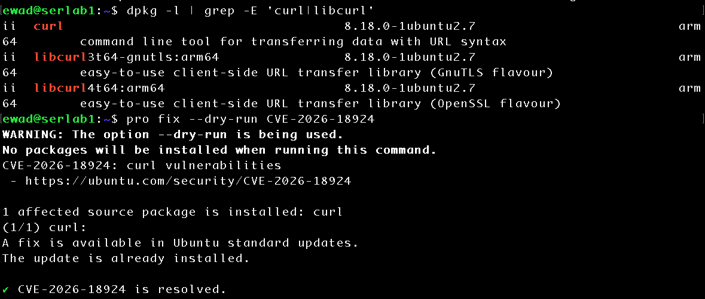

# Vulnerability Assessment and Remediation

## Objective

Establish a security-update baseline, investigate an applicable vulnerability, perform targeted remediation, and validate the resulting security state. 

## Lab Environment

- **Server:** serlab1
- **Operating System:** Ubuntu Server 26.04.1 LTS (ARM64)
- **Hypervisor:** UTM
- **Client:** macOS
- **Remote Administration:** OpenSSH

## Security Update Baseline

```bash
sudo apt update
```

Refreshed local package metadata from the configured Ubuntu repositories. 

```bash
apt list --upgradable
```

Listed installed packages with newer candidate versions available.  

```bash
pro security-status
```

Reviewed installed package security coverage and identified packages with available Ubuntu security updates. 

25 total packages had available updates after refreshing repository metadata, of which Ubuntu identified 15 as standard security updates. 



```bash
apt policy curl
```

Used `apt policy` to compare the installed package revision against the current candidate revision: 

```text
Installed: 8.18.0-1ubuntu2.5
Candidate: 8.18.0-1ubuntu2.7
```

## Vulnerability Investigation

Selected the `curl` package for additional investigation after Ubuntu identified an available standard security update. 

```bash
pro fix --dry-run CVE-2026-18924
```

Confirmed the affected source package is installed and a fix is available with Ubuntu standard updates.

```bash
dpkg -l | grep -E 'curl|libcurl'
```

```bash
curl --version
```

Inspected the installed `curl` and `libcurl` packages and confirmed Ubuntu package revision `8.18.0-1ubuntu2.5`. The `curl --version` output additionally showed the upstream application version and Ubuntu security-patched package revision.  

## Exposure and Risk Assessment

```bash
sudo ss -tulpn
```

After confirming that an affected `curl` package was installed, reviewed listening TCP/UDP sockets to determine whether `curl` or `libcurl` was providing a listening network service on serlab1. Neither package was observed listening for inbound connections. The vulnerability still required remediation, but its technical severity was considered separately from the specific network exposure and role of the asset. 

## Remediation

```bash
sudo apt install --only-upgrade curl libcurl3t64-gnutls libcurl4t64
```

For this exercise, targeted remediation was applied only to the packages associated with the investigated vulnerability so that a before and after state could be validated independently. 

## Validation

```bash
dpkg -l | grep -E 'curl|libcurl'
```

Confirmed targeted packages were updated to `8.18.0-1ubuntu2.7` as intended to apply the security patch. 

```bash
curl --version
```

```text
Security patched: 8.18.0-1ubuntu2.7
```

Reassessed the same CVE:

```bash
pro fix --dry-run CVE-2026-18924
```

```text
The update is already installed. 
CVE-2026-18924 is resolved. 
```



## Security Outcome

Successfully identified and remediated an applicable vulnerability affecting installed `curl` packages on serlab1. Targeted security updates changed the Ubuntu package revision from `8.18.0-1ubuntu2.5` to `8.18.0-1ubuntu2.7`. Post-remediation validation confirmed the updated packages were installed and Ubuntu security tooling reported CVE-2026-18924 as resolved. 

## Lessons Learned 

This exercise demonstrated the importance of differentiating between an upstream application version and a distribution-specific package revision. Both the affected and remediated versions reported `curl 8.18.0`; however, the Ubuntu package revision changed from `8.18.0-1ubuntu2.5` to the security-patched `8.18.0-1ubuntu2.7`. This demonstrated why vulnerability assessment cannot always rely solely on an application's upstream version number. 

The investigation also demonstrated that CVSS severity should be considered alongside vulnerability applicability, asset exposure, and organizational risk. These concepts are related but distinct, and a technically severe vulnerability does not by itself describe the complete risk to a particular asset. 

Finally, targeted remediation followed by reassessment of the same CVE demonstrated the importance of validating a security change rather than assuming successful installation means the vulnerability has been resolved. 


