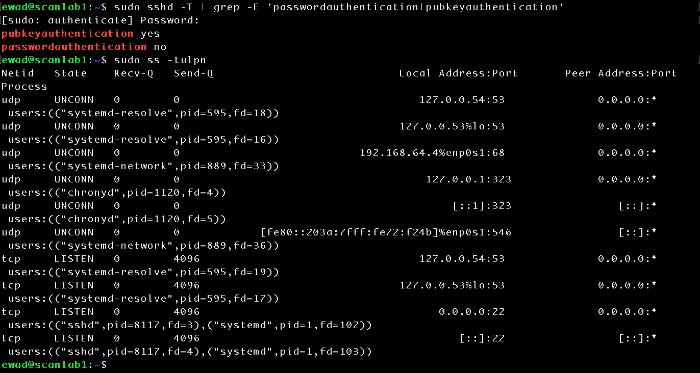
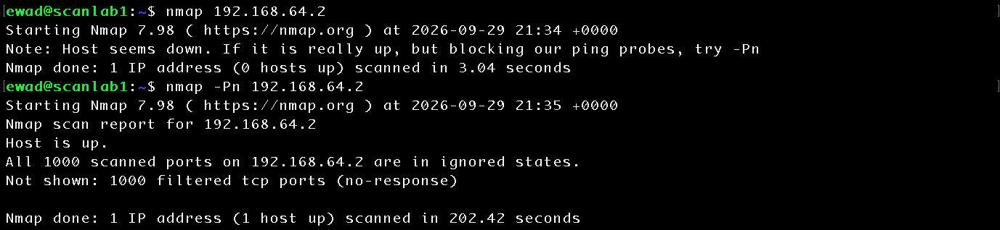
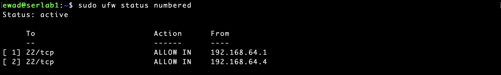
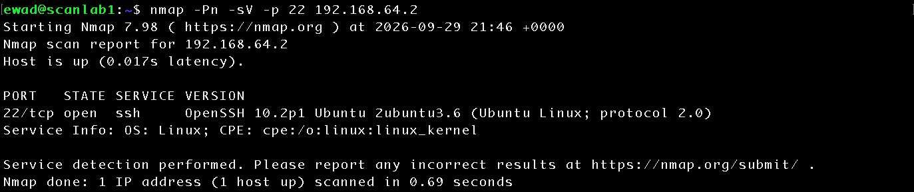

# Network Service Assessment with Nmap

## Objective

Perform a network-based assessment of `serlab1` from a separate Ubuntu Server host using Nmap. Compare locally observed listening services with externally observable network exposure and evaluate the effect of source-based firewall rules on service discovery.

## Lab Environment

- **Target:** serlab1 - Ubuntu Server 26.04.1 LTS (ARM64)
- **Scanner:** scanlab1 - Ubuntu Server 26.04.1 LTS (ARM64)
- **Hypervisor:** UTM
- **Network:** UTM Shared Network
- **serlab1 IPv4:** `192.168.64.2`
- **scanlab1 IPv4:** `192.168.64.4`
- **Scanner:** Nmap 7.98
- **Host Firewall:** UFW

## Scanner Baseline

Prior to network assessment, `scanlab1` was configured for SSH public-key authentication with password authentication disabled.

```bash
sudo sshd -T | grep -E 'passwordauthentication|pubkeyauthentication'
```

The effective SSH configuration confirmed: 

```text
pubkeyauthentication yes
passwordauthentication no
```

Listening TCP and UDP sockets were also reviewed with:

```bash
sudo ss -tulpn
```

This established the initial service baseline before additional vulnerability-assessment tooling was introduced.



## Initial Network Assessment

A default Nmap scan was first attempted against `serlab1`:

```bash
nmap 192.168.64.2
```

Nmap initially reported that the host appeared to be down. Because `serlab1` was known to be operational, host discovery was bypassed using: 

```bash
nmap -Pn 192.168.64.2
```

The scan identified the host as operational but reported all 1,000 scanned TCP ports as filtered with no response. 



This demonstrated that the target being operational did not necessarily make its services discoverable from another host. Network filtering was preventing `scanlab1` from determining whether the scanned ports were open or closed. 

## Firewall Investigation

The UFW configuration on `serlab1` was reviewed using: 

```bash
sudo ufw status verbose
```

```bash
sudo ufw status numbered
```

The firewall used a default-deny incoming policy. TCP port 22 was permitted only from `192.168.64.1`, which represents the administrative traffic reaching `serlab1` from the macOS host through the UTM shared-network environment.

An established SSH connection was examined with:

```bash
ss -tnp | grep ':22'
```

The connection showed `serlab1` at `192.168.64.2:22` communicating with a client presented as `192.168.64.1` using an ephemeral source port. This confirmed why SSH administration from the macOS host was permitted while probes originating directly from `scanlab1` at `192.168.64.4` were filtered. 

## Source-Based Firewall Authorization

To permit the designated assessment host to reach the SSH service while maintaining a least-privilege firewall policy, a source-specific rule was added:

```bash
sudo ufw allow from 192.168.64.4 to any port 22 proto tcp
```

The resulting UFW configuration permitted TCP port 22 from both the existing administrative source and the designated scanning host. 



No changes were made to the SSH service itself. The change affected only whether traffic originating from `scanlab1` was permitted through the host firewall. 

## Validation with Nmap

A targeted scan of TCP port 22 was performed from `scanlab1`:

```bash
nmap -Pn -p 22 192.168.64.2
```

After the firewall change, Nmap reported:

```text
22/tcp open ssh
```

This demonstrated the difference between a service listening locally and that service being reachable from a particular external source. 

Service/version detection was then performed: 

```bash
nmap -Pn -sV -p 22 192.168.64.2
```

Nmap identified the externally accessible service as: 

```text
OpenSSH 10.2p1 Ubuntu 2ubuntu3.6
```



## Security Outcome

The assessment demonstrated that `serlab1`'s default-deny firewall policy prevented an unauthorized peer host from discovering its listening SSH service. After `scanlab1` was explicitly authorized to reach TCP port 22, Nmap identified the port as open and successfully performed service/version detection. 

The SSH service itself remained unchanged throughout the experiment. The change in Nmap results was caused by modification of the source-based firewall policy, demonstrating how host firewall controls affect externally observable attack surface. 

## Lessons Learned

This exercise demonstrated the distinction between a locally listening service and a remotely reachable service. A process may be listening on a network socket while still appearing filtered to another system because of firewall controls.

Nmap port states describe what the scanner can determine from its position on the network. A `filtered` result does not necessarily mean that no service is listening; it can indicate that a firewall or other network control prevents the scanner from receiving enough information to determine whether the port is open or closed. 

This exercise also demonstrated the importance of source-based access controls. `serlab1` permitted SSH administration from the existing UTM administrative source while initially denying the same service to `scanlab1`. Explicitly authorizing only the designated assessment host maintained a more restrictive policy than broadly exposing SSH to the entire subnet. 

Finally, service/version detection demonstrated how network assessment can identify externally visible software information. Detected version information can support vulnerability investigation, but version identification alone does not establish that a vulnerability is present. Distribution-specific package revisions, security patches, configuration, exposure, and vulnerability applicability must also be evaluated.
