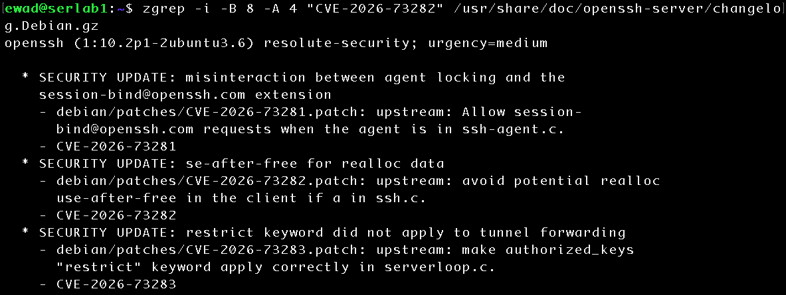
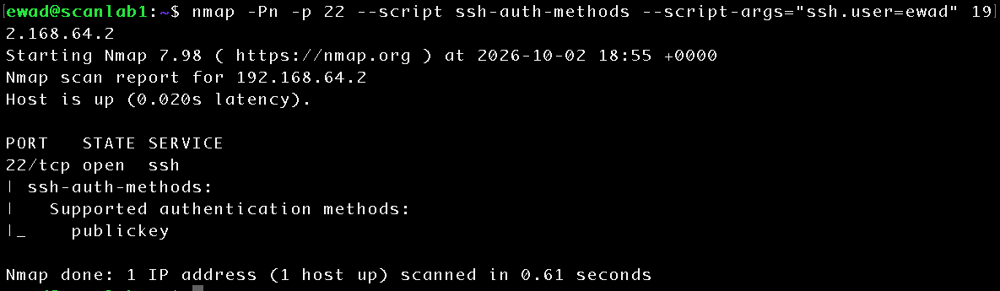
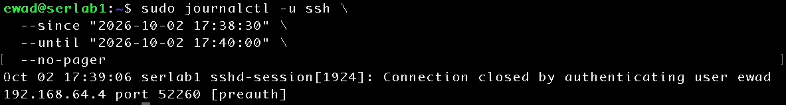
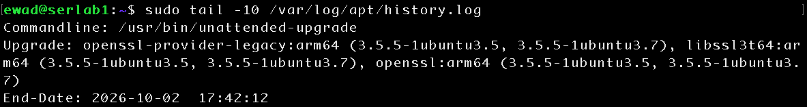
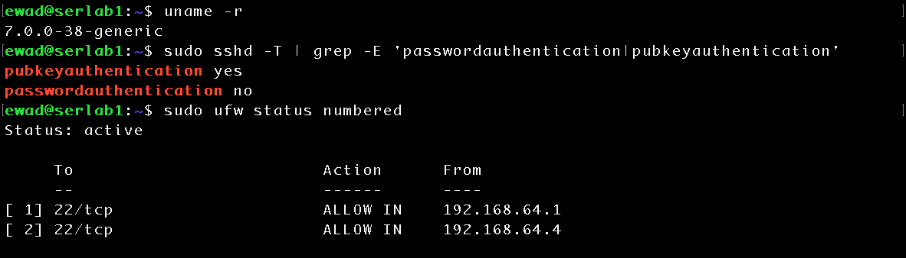

# Vulnerability Assessment and Validation

## Objective

Perform a vulnerability-focused assessment of `serlab1` using remotely observed service information, local package metadata, vendor security information, and system logs. Evaluate whether an identified OpenSSH version indicates an actionable vulnerability, validate the existing SSH authentication controls from an external host, investigate unexpected service activity observed during the assessment, and perform system remediation with post-remediation validation.

## Lab Environment

- **Target:** serlab1 - Ubuntu Server 26.04.1 LTS (ARM64)
- **Assessment Host:** scanlab1 - Ubuntu Server 26.04.1 LTS (ARM64)
- **Hypervisor:** UTM
- **Network:** UTM Shared Network
- **serlab1 IPv4:** `192.168.64.2`
- **scanlab1 IPv4:** `192.168.64.4`
- **Scanner:** Nmap 7.98
- **Host Firewall:** UFW

## Initial Service Finding

A previous network assessment identified TCP port 22 as reachable from the authorized assessment host and performed service/version detection:

```bash
nmap -Pn -sV -p 22 192.168.64.2
```

The remotely observable service was identified as:

```text
22/tcp open  ssh  OpenSSH 10.2p1 Ubuntu 2ubuntu3.6
```

Service/version information can provide a starting point for vulnerability research, but an upstream software version alone is insufficient to determine whether a distribution-maintained package remains vulnerable. Distribution-specific package revisions and backported security fixes must also be considered.

## Package and Patch Validation

The exact OpenSSH server package installed on `serlab1` was queried using the local Debian package database:

```bash
dpkg-query -W -f='${Package}\t${Version}\n' openssh-server
```

The installed package was reported as: 

```text
openssh-server 1:10.2p1-2ubuntu3.6
```

This result was consistent with the OpenSSH version and Ubuntu package revision identified remotely by Nmap. 

Before evaluating the package's security status, the local APT package information was refreshed: 

```bash
sudo apt update
```

APT initially identified 20 packages with available updates. `openssh-server` was not included among the upgradable packages. 

The OpenSSH package policy was then examined directly:

```bash
apt policy openssh-server
```

The installed and candidate versions were identical: 

```text
Installed: 1:10.2p1-2ubuntu3.6
Candidate: 1:10.2p1-2ubuntu3.6
```

The installed revision was available through both the `resolute-updates` and `resolute-security` repositories. This established that, after refreshing the repository metadata, Ubuntu was not offering a newer OpenSSH server package to the host. 

This did not by itself establish that the software contained no vulnerabilities. It established that the installed OpenSSH package was current according to the Ubuntu repositories configured on `serlab1`.

## CVE Validation and Backported Security Fixes

The remotely identified OpenSSH version was evaluated against current vulnerability information. CVE-2026-73282 was selected as a validation case because the affected upstream OpenSSH version range could cause a version-based assessment to identify OpenSSH 10.2p1 as potentially vulnerable.

The Ubuntu security information for the `openssh` source package identifies the vulnerability as fixed for Ubuntu 26.04 LTS in package revision:

```text
1:10.2p1-2ubuntu3.6
```

This exactly matched the package installed on `serlab1`.

To independently verify that the installed Ubuntu package incorporated the security fix, the local Debian package changelog was searched. 

```bash
zgrep -i -B 8 -A 4 "CVE-2026-73282" /usr/share/doc/openssh-server/changelog.Debian.gz
```

The installed changelog identified the `1:10.2p1-2ubuntu3.6` security revision and explicitly referenced the associated patch: 

```text
openssh (1:10.2p1-2ubuntu3.6) resolute-security; urgency=medium

* SECURITY UPDATE: use-after-free for realloc data
  - debian/patches/CVE-2026-73282.patch
  - CVE-2026-73282
```



The assessment therefore determined that the upstream `10.2p1` version string alone was insufficient to classify the host as vulnerable to CVE-2026-73282. Ubuntu had incorporated the relevant security fix into its distribution-specific `1:10.2p1-2ubuntu3.6` package while retaining the OpenSSH 10.2p1 upstream version. 

A vulnerability finding based solely on the upstream service version could therefore incorrectly classify this host as affected. Vendor package revisions and security-maintenance information must be evaluated before determining vulnerability applicability. 

## SSH Authentication Exposure Validation

The effective SSH configuration on `serlab1` had previously been hardened to permit public-key authentication while disabling password authentication. The local configuration was verified with:

```bash
sudo sshd -T | grep -E 'passwordauthentication|pubkeyauthentication'
```

The effective configuration reported:

```text
pubkeyauthentication yes
passwordauthentication no
```

To validate the control independently from another host, the `ssh-auth-methods` Nmap Scripting Engine (NSE) script was reviewed and then executed from `scanlab1`:

```bash
nmap -Pn -p 22 --script ssh-auth-methods --script-args="ssh.user=ewad" 192.168.64.2
```

The assessment reported:

```text
22/tcp open  ssh
| ssh-auth-methods:
|   Supported authentication methods:
|_    publickey
```



The external result agreed with the effective SSH configuration on the target. Password authentication was not offered to the assessed account, while public-key authentication remained available.

This provided independent network-based validation that the SSH authentication hardening was operating as intended rather than relying only on the target's local configuration.

## Log Correlation and Unexpected Service Activity

Because the `ssh-auth-methods` NSE script initiates an SSH authentication interaction, the corresponding server logs were reviewed to determine whether the assessment activity generated observable telemetry.

The SSH journal on `serlab1` was queried around the time of the assessment:

```bash
sudo journalctl -u ssh \
  --since "2026-10-02 17:38:30" \
  --until "2026-10-02 17:40:00" \
  --no-pager
```

The journal recorded the following pre-authentication event:

```text
Oct 02 17:39:06 serlab1 sshd-session[1924]: Connection closed by authenticating user ewad 192.168.64.4 port 52260 [preauth]
```



The event identified `192.168.64.4`, the address of `scanlab1`, as the source and identified `ewad` as the account supplied to the NSE script. The `[preauth]` designation indicated that the connection ended during the SSH pre-authentication phase rather than completing a successful login.

This demonstrated that externally generated assessment activity could be correlated with host-side security telemetry using the source address, username, timestamp, and authentication state.

### Investigation of an Unexpected SSH Restart

While reviewing the SSH journal, an unexpected restart of the SSH service was observed approximately three minutes after the Nmap assessment. Because the restart had not been initiated manually, the system journal was examined across a wider time window rather than assuming that the preceding assessment activity caused the restart.

The broader journal showed the following sequence:

```text
17:42:08  apt-daily-upgrade.service started
17:42:18  systemd reexecution requested
17:42:19  ssh.service stopped
17:42:19  multiple system services were cycled
17:42:19  ssh.service started
17:42:20  apt-daily-upgrade.service completed
```

The APT history was then reviewed to determine what package-management activity occurred during the same period:

```bash
sudo tail -50 /var/log/apt/history.log
```

The package history identified an unattended upgrade beginning at `17:42:11` that updated `openssl`, `libssl3t64`, and `openssl-provider-legacy`.

```text
Start-Date: 2026-10-02  17:42:11
Commandline: /usr/bin/unattended-upgrade
Upgrade: openssl-provider-legacy:arm64 (3.5.5-1ubuntu3.5, 3.5.5-1ubuntu3.7), libssl3t64:arm64 (3.5.5-1ubuntu3.5, 3.5.5-1ubuntu3.7), openssl:arm64 (3.5.5-1ubuntu3.5, 3.5.5-1ubuntu3.7)
End-Date: 2026-10-02  17:42:12
```



The investigation therefore associated the service activity with legitimate automated package maintenance rather than the earlier Nmap authentication assessment. OpenSSH itself was not upgraded during this event.

This investigation demonstrated the importance of distinguishing temporal correlation from causation. An unexpected service restart occurring shortly after security testing did not establish that the test caused the restart. Expanding the investigation to the system journal and APT history provided the additional evidence necessary to explain the event.

## Remediation and Post-Remediation Validation

Following the assessment, the remaining available system updates were reviewed before installation. APT proposed 15 package upgrades and seven new dependencies associated primarily with the updated kernel and supporting components. No packages were scheduled for removal, while two packages were temporarily withheld by Ubuntu's phased-update mechanism.

Before remediation, the running kernel was identified with:

```bash
uname -r
```

The system was running:

```text
7.0.0-34-generic
```

The available updates were then installed:

```bash
sudo apt upgrade
```

The upgrade installed the `7.0.0-38` kernel and associated modules, headers, and tools. After installation, the system reported that the new kernel was present but not yet active:

```text
Pending kernel upgrade!

Running kernel version:
  7.0.0-34-generic

The currently running kernel version is not the expected kernel version
7.0.0-38-generic.
```

The reboot requirement was independently verified using:

```bash
test -f /var/run/reboot-required && cat /var/run/reboot-required
```

which returned:

```text
*** System restart required ***
```

`serlab1` was then rebooted to complete the kernel transition. After reconnecting, the active kernel was verified:

```bash
uname -r
```

```text
7.0.0-38-generic
```

### Security Control Validation

Following the reboot, the effective SSH authentication configuration was checked again:

```bash
sudo sshd -T | grep -E 'passwordauthentication|pubkeyauthentication'
```

The hardened configuration remained in effect:

```text
pubkeyauthentication yes
passwordauthentication no
```

The UFW configuration was also reviewed:

```bash
sudo ufw status numbered
```

The firewall remained active and retained the source-specific SSH rules:

```text
Status: active

     To                         Action      From
     --                         ------      ----
[ 1] 22/tcp                     ALLOW IN    192.168.64.1
[ 2] 22/tcp                     ALLOW IN    192.168.64.4
```



The system therefore retained both its SSH authentication hardening and source-based firewall policy through the package upgrade and reboot.

### External Post-Remediation Validation

The SSH authentication assessment was repeated from `scanlab1` using the same methodology as the pre-remediation test:

```bash
nmap -Pn -p 22 --script ssh-auth-methods --script-args="ssh.user=ewad" 192.168.64.2
```

The external assessment continued to report:

```text
22/tcp open  ssh
| ssh-auth-methods:
|   Supported authentication methods:
|_    publickey
```

This confirmed that the remediation process did not regress the externally observable SSH authentication control.

A final review of available package updates showed only:

```text
python3-software-properties
software-properties-common
```

These packages had previously been identified by APT as temporarily withheld due to Ubuntu's phased-update mechanism. They were not forced outside the normal update process.

At the conclusion of remediation, `serlab1` was running the updated `7.0.0-38-generic` kernel, the SSH and firewall hardening controls remained intact, and no immediately applicable updates remained.

## Security Outcome

The assessment identified OpenSSH as the primary remotely reachable service authorized for assessment from `scanlab1`. Service/version detection reported OpenSSH 10.2p1 with Ubuntu package revision `2ubuntu3.6`.

Further validation determined that the installed `openssh-server` package was `1:10.2p1-2ubuntu3.6`, matching the current candidate available through the configured Ubuntu repositories. Investigation of CVE-2026-73282 demonstrated that the installed Ubuntu package contained a distribution-maintained security patch even though the externally visible upstream version remained OpenSSH 10.2p1. The host was therefore not identified as requiring remediation for the assessed CVE based solely on its upstream version string.

SSH authentication controls were validated from both the target and an independent assessment host. The effective server configuration disabled password authentication and enabled public-key authentication, while external NSE enumeration reported only `publickey` as an available authentication method for the assessed account.

The assessment activity also generated observable host telemetry. The Nmap authentication interaction was correlated with an SSH `[preauth]` event originating from `scanlab1`. An unrelated SSH service restart discovered during log review was investigated through the system journal and APT history and associated with legitimate unattended package maintenance rather than the preceding network assessment.

Remaining immediately applicable system updates were subsequently installed. After reboot, `serlab1` was verified to be running kernel `7.0.0-38-generic`. SSH hardening and source-specific UFW rules remained intact, and external authentication-method validation continued to report only public-key authentication.

No actionable vulnerability was established for the OpenSSH CVE evaluated during this assessment. Two non-immediate package updates remained visible through APT because of Ubuntu's phased-update mechanism and were left to the normal update process.

## Lessons Learned

This assessment demonstrated that service identification and vulnerability validation are separate activities. Nmap can identify externally observable software and version information, but a version string alone does not establish vulnerability applicability.

Linux distributions may backport security fixes while retaining an older upstream software version. As demonstrated with OpenSSH, the externally visible `10.2p1` version could appear to fall within an affected upstream version range even though Ubuntu's `1:10.2p1-2ubuntu3.6` package contained the relevant security patch. Accurate vulnerability analysis therefore requires evaluation of distribution-specific package revisions, vendor security information, and local package evidence.

The assessment also demonstrated the value of validating security controls from multiple perspectives. Reviewing `sshd` configuration locally established the intended authentication policy, while Nmap NSE enumeration from `scanlab1` independently confirmed the authentication method exposed over the network.

Log correlation provided additional insight into both assessment activity and normal system behavior. Source addresses, timestamps, usernames, and authentication states allowed the Nmap interaction to be correlated with the corresponding SSH event. When an unexpected service restart was discovered, expanding the investigation across multiple log sources prevented an unsupported assumption that the preceding security test had caused it.

Finally, remediation required more than installing updates. The updated kernel did not become active until the host was rebooted, and the security configuration was revalidated afterward. Repeating the external assessment after remediation confirmed that patching and rebooting had not introduced a regression in the SSH authentication controls.

The overall exercise reinforced a vulnerability-management workflow of identifying exposure, validating findings, correlating supporting evidence, applying appropriate remediation, and verifying the resulting system state.
